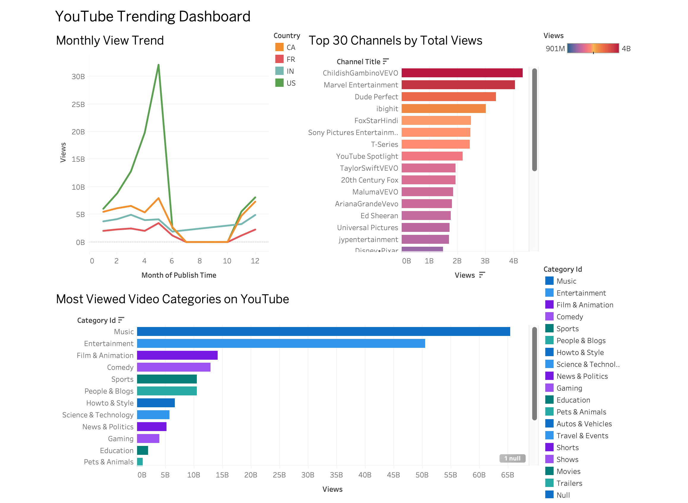

# YouTube Trending Video Analysis Project 📈

This project analyzes trending YouTube videos across different countries, identifying patterns in creators, categories, and engagement metrics. It involves:

- Exploratory Data Analysis (EDA) using Jupyter Notebooks
- SQLite database storage
- Tableau dashboard visualization
- prediction using ML models (e.g. trending classification)

---


## Questions Answered

1. Which categories trend the most in each country?
2. Which creators trend the most often?
3. What makes a video perform well?
4. Can we predict whether a video will trend using views, likes, etc.?

---

## 🔧 Setup Instructions

1. Clone the repository
2. Install dependencies:
   ```bash
   pip install -r requirements.txt

3. Open JupyterLab: jupyter lab
4. Run the notebooks inside notebooks/ to explore.

Data Source:
Data from [https://chatgpt.com/c/686bbd2c-45c4-8002-bf79-fdc9cc36b38f#:~:text=Data%20from-,Kaggle,-%2D%20Trending%20YouTube%20Video]

Dashboard:

